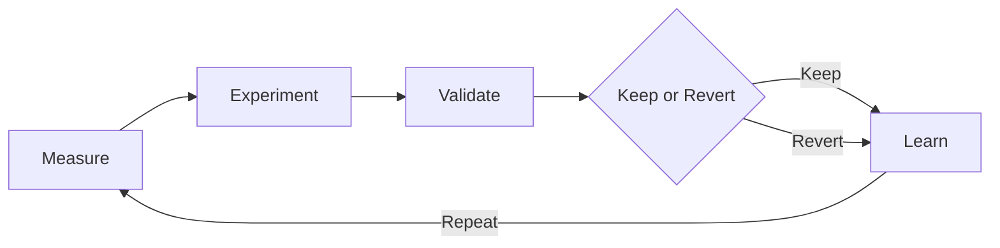
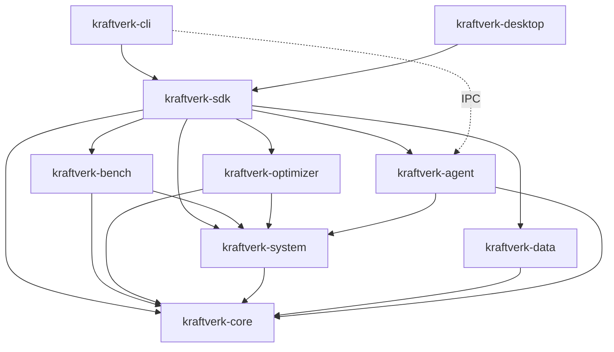

<p align="center">
  
</p>

<h1 align="center">
  Kraftverk
  
  🇸🇪
</h1>

<p align="center">
  <strong>Evidence-driven systems performance platform</strong><br />
  Measure real work → experiment with reversible settings → keep only what statistically improves.
</p>

<p align="center">
  <a href="https://github.com/theworker02/kraftverk/actions/workflows/ci.yml"></a>
  <a href="LICENSE"></a>
  <a href="https://github.com/theworker02/kraftverk/releases"></a>
  
  
  
  <a href="https://github.com/sponsors/theworker02"></a>
  <a href="https://thanks.dev/u/gh/theworker02"></a>
</p>

<p align="center">
  <a href="https://theworker02.github.io/kraftverk/">Docs site</a> ·
  <a href="https://github.com/theworker02/kraftverk/releases">Releases</a> ·
  <a href="docs/hardware-support.md">Hardware support</a> ·
  <a href="CHANGELOG.md">Changelog</a> ·
  <a href="https://github.com/sponsors/theworker02">Sponsors</a>
</p>

---

## Name & etymology

**Kraftverk** is Swedish-inspired: *kraftverk* means **power plant**, **powerhouse**, or **power station** — a facility that converts energy into usable power through engineered process, not wishful thinking.

That metaphor is intentional. Kraftverk treats your machine like a plant under instrumentation: measure the work, change one controllable input at a time, validate the output, and keep only what the data supports.

| | |
|--|--|
| Language cue | Swedish *kraft* (power / force) + *verk* (works / plant) |
| Product reading | A performance **powerhouse** for AMD systems |
| Flag | 🇸🇪 — cultural etymology only |

**Independent product.** Kraftverk is **not** affiliated with, endorsed by, or sponsored by Advanced Micro Devices, Inc., the Kingdom of Sweden, or any Swedish government entity. “AMD” in this repository means CPU/GPU vendor identity detected on the host (CPUID / PCI), not a partnership claim. Kraftverk does not use AMD logos and makes no “official AMD” claim.

---

## What it is

Kraftverk is a **local-first performance engineering instrument** for **AMD** x86/x86_64 systems. It:

- Discovers hardware facts and enforces an **AMD-only** eligibility gate (`amd-only-v1`)
- Runs **KraftBench** — real, deterministic workloads with checksums where practical
- Builds a **Kraft Index** (baseline-normalized composite score)
- Searches **reversible** tunables (process-scoped workers, priority, affinity; privileged power schemes via agent)
- Accepts a candidate only after **statistical validation** against the baseline
- Persists experiments, sessions, receipts, and HTML/JSON reports in a local SQLite store
- Offers a CLI, optional privileged agent, and a desktop instrument (default local web UI; optional Tauri)

It is designed for people who want **evidence**, not marketing FPS claims.

## What it is NOT

| Not this | Why it matters |
|----------|----------------|
| A PC “cleaner” | No temp-folder theater, no registry spray-and-pray |
| A placebo FPS booster | No magic buttons; no invented scores |
| A cloud optimization service | Telemetry and history stay on your machine |
| An AMD-endorsed product | Independent tool; trademark disclaimer above |
| A firmware / BIOS flash utility | No irreversible firmware changes in scope |
| A cross-vendor tuner | Intel CPU / NVIDIA or Intel GPU hosts are **blocked** |

---

## Philosophy

Every optimization must improve **measured** performance, efficiency, stability, latency, thermal behavior, or instrumentation quality. No fabricated telemetry. No silent irreversible tweaks.



<p align="center">
  
</p>

**Expanded loop**

1. **Measure** — KraftBench samples + telemetry snapshot
2. **Experiment** — propose a reversible candidate (search strategy)
3. **Apply** — journaled apply + verify
4. **Benchmark** — re-measure under the candidate
5. **Validate** — stability gate + comparison class vs baseline
6. **Keep or Revert** — commit only validated accepts; otherwise rollback
7. **Learn** — history, insights, lineage, receipts
8. **Repeat** — until budget / plateau / neighborhood exhausted

---

## Hardware policy (`amd-only-v1`)

This is a **hard gate** across CLI, desktop, SDK, agent, and optimizer — not a cosmetic preference.

| Requirement | Rule |
|-------------|------|
| Architecture | **x86 / x86_64** only (`compile_error!` on other targets) |
| CPU | **AMD** (`AuthenticAMD`) via CPUID |
| GPU | None → allowed; if present, **all** must be AMD (PCI vendor `0x1002`) |
| Blocked | Intel CPU; NVIDIA (`0x10DE`); Intel GPU (`0x8086`); mixed AMD+NVIDIA; unknown vendors |

**Exit codes 20–25**

| Code | Meaning |
|-----:|---------|
| 20 | Unsupported architecture |
| 21 | Intel CPU detected |
| 22 | NVIDIA GPU detected |
| 23 | Intel GPU detected |
| 24 | Unknown CPU vendor |
| 25 | Unsupported combination (mixed / unknown GPU / other) |

There is **no** production `--force` bypass. Tests may inject facts via the `kraftverk-system/mock-platform` feature.

**Inspect-only** (no gate — useful to explain *why* a machine is blocked):

```bash
kraftverk compatibility
kraftverk hardware
kraftverk amd cpu
kraftverk amd gpu
```

Hot-plug: if an NVIDIA GPU appears mid-session, Kraftverk stops experiments, restores managed config, and blocks further execution.

Full policy: [docs/hardware-support.md](docs/hardware-support.md) · platforms: [docs/platforms.md](docs/platforms.md).

---

## KraftBench & Kraft Index

### KraftBench

KraftBench runs **real** deterministic workloads. Scores come from wall-clock timing of completed work, with checksums where practical. Categories include:

| Category | Examples |
|----------|----------|
| CPU | Integer single/multi, float, hashing, compression; compile-proxy / scaling suites |
| Memory | Sequential R/W proxy, random chase, allocation |
| Storage | Seq/rand R/W **only** under Kraftverk scratch (never Documents/Desktop) |
| System | Thread create, barrier sync, wake latency |
| Realtime | Pipeline / parse / parallel stand-ins; responsiveness index |
| GPU | AMD Vulkan via `ash` (buffer-copy bandwidth, compute, reduction/hash-style) when an AMD Vulkan device is present; otherwise **honest `Unsupported` skip** — never fabricated |

GPU benches are behind the `kraftverk-bench` feature `gpu` (**default on**). Sustained windows: `kraftverk benchmark --sustained 10m`.

Methodology notes: [docs/benchmarking.md](docs/benchmarking.md) (some older “M1 unsupported GPU” lines are superseded by the Vulkan backend shipped in current `main`).

### Kraft Index

A **weighted composite** of category scores:

1. Each measurement contributes a higher-is-better score
2. Within a category, scores combine with a **geometric mean**
3. Categories blend with documented weights
4. Missing categories cause **renormalization** over present weights
5. Baseline mean raw composite maps to **10,000**
6. Later runs: `index = (raw / baseline_raw) * 10000`

**Default weights** (no GPU measurements): CPU 0.40 · Memory 0.20 · Storage 0.15 · System 0.10 · Realtime 0.15 · GPU 0.00

**With real GPU measurements** (`KraftIndexWeights::with_gpu`): CPU 0.34 · Memory 0.17 · Storage 0.13 · System 0.09 · Realtime 0.12 · GPU 0.15

Details: [docs/kraft-index.md](docs/kraft-index.md).

### Statistics

Per-sample summaries include mean, median, CoV, percentiles, and approximate CIs. Candidate vs baseline comparison classes:

`CONFIRMED_IMPROVEMENT` · `LIKELY_IMPROVEMENT` · `NO_SIGNIFICANT_CHANGE` · `LIKELY_REGRESSION` · `CONFIRMED_REGRESSION` · `UNSTABLE_RESULT`

These are **decision aids**, not formal lab hypothesis tests. See [docs/statistics.md](docs/statistics.md).

---

## Optimization loop & safety

### Modes & goals

```bash
kraftverk optimize --mode safe --goal balanced
kraftverk optimize --mode balanced --goal compile
kraftverk optimize --mode aggressive --goal throughput
```

| Mode | Intent |
|------|--------|
| `safe` | Reversible, low-risk, process/workload-scoped knobs |
| `balanced` | Broader reversible search within safe knobs |
| `aggressive` | Widest reversible search; still no irreversible firmware |

**Goals:** `balanced` · `gaming` · `compile` · `workstation` · `throughput` · `latency` · `efficiency` · `sustained` · `quiet`

### Search strategies

```bash
kraftverk optimize --strategy hill-climb
kraftverk optimize --strategy epsilon-greedy
kraftverk optimize --strategy bayesian
```

| Strategy | Behavior |
|----------|----------|
| `hill-climb` | Deterministic neighborhood climb (default family; seedable) |
| `epsilon-greedy` | ε-greedy multi-armed bandit with decay |
| `bayesian` | Gaussian-process style + expected improvement |

Also: `--seed`, `--max-experiments`, `--time-budget-secs`, `--max-temp`, `--max-power`, `--max-workers`, `--resume <session-id>`.

### Safety mechanics

- **Allow-listed parameters only** for in-process safe tuning (`bench.worker_threads`, `bench.rayon_threads`, `process.priority`, `process.affinity`)
- **Apply → verify → rollback** with a recovery journal (`ApplyGuard`)
- Search iterations **roll back**; only validated accepts remain applied
- `kraftverk restore` / `kraftverk restore --baseline` clears active accepted config
- Crash recovery restores interrupted applies on launch
- Storage benches refuse user content roots
- Optimizer `--max-temp` / `--max-power` enforce only when real sensor readings exist

See [docs/safety.md](docs/safety.md) · [docs/optimizer.md](docs/optimizer.md).

### Evidence artifacts

```bash
kraftverk report --format html
kraftverk report --format json -o report.json
kraftverk receipt <experiment-id>
kraftverk receipt --verify path/to.kraft-receipt.json
kraftverk explain <id>
kraftverk compare <a> <b>
kraftverk analyze recent
```

---

## Architecture (≤10 first-party crates)

```
crates/
├── kraftverk-core/       # Domain models, stats, Kraft Index, goals/constraints
├── kraftverk-system/     # Platform + hardware eligibility + sensors/telemetry
├── kraftverk-bench/      # KraftBench workloads (CPU… + optional AMD Vulkan GPU)
├── kraftverk-optimizer/  # Search strategies, profiles, objectives
├── kraftverk-data/       # SQLite store, reports, receipts, sessions
├── kraftverk-agent/      # Privileged agent + authenticated local IPC
├── kraftverk-sdk/        # Stable facade re-exports for integrations
├── kraftverk-cli/        # `kraftverk` binary
└── kraftverk-desktop/    # Desktop instrument (web UI default; Tauri optional)
```



Control flow (simplified): CLI opens a session (fingerprint, DB, journal recovery) → baseline/benchmark → optimize proposes candidates → ApplyGuard → measure → compare → rollback or commit.

More: [docs/architecture.md](docs/architecture.md) · diagram asset: [assets/architecture-flow.svg](assets/architecture-flow.svg).

---

## CLI command reference

Binary name: **`kraftverk`**. Global flags: `--json`, `-q` / `--quiet`, `-v` / `--verbose`, `-h`, `-V`.

| Command | Purpose |
|---------|---------|
| `inspect` | Hardware / OS facts and machine fingerprint |
| `compatibility` | Inspect-only AMD compatibility report (no gate) |
| `hardware` | Inspect-only CPU/GPU inventory (CPUID + PCI) |
| `amd cpu` / `amd gpu` | AMD capability surfaces (honest unset when unknown) |
| `baseline` | Create baseline Kraft Index (→ 10,000) |
| `benchmark` | Run KraftBench without creating a baseline (`--sustained`) |
| `optimize` | Search + validate (`--mode`, `--goal`, `--strategy`, …) |
| `status` | Current status, baseline, active candidate |
| `history` | Recent experiments |
| `explain <id>` | Explain an experiment (prefix ok) |
| `compare` | Compare two experiments |
| `profiles` | List optimization profiles + support status |
| `profile list\|recommend\|export\|inspect\|validate\|apply` | Profile package workflow |
| `restore [--baseline]` | Roll back active accepted changes |
| `capabilities` | Platform capability matrix |
| `doctor` | Health / environment checks (incl. agent / sensors) |
| `insights` | Derived insights from history |
| `lineage` | Experiment lineage |
| `sessions` | List optimize sessions |
| `report` | HTML/JSON evidence report |
| `chase [COMMAND]...` | Time an external command |
| `analyze [TARGET]` | Analyze experiment id or `recent` |
| `receipt` | Export or `--verify` an evidence receipt |
| `agent serve\|status` | Privileged agent (authenticated local IPC) |
| `dev` | Development helpers (feature-gated) |

```bash
kraftverk --help
kraftverk optimize --help
kraftverk agent --help
```

---

## Desktop

Default build is a **local axum web UI** (CI-safe; no WebView SDK required):

```bash
cargo run -p kraftverk-desktop
# → http://127.0.0.1:47821/
```

Optional **Tauri** native shell (feature `tauri-app`; requires WebView2 on Windows / webkit2gtk on Linux):

```bash
cargo run -p kraftverk-desktop --no-default-features --features tauri-app
```

Same local SQLite / eligibility gate as the CLI. Hardware blockers and Safety Center live in the desktop instrument UI.

Typed control client for the same HTTP API: [`packages/sdk`](packages/sdk) (`@theworker02/kraftverk-sdk`).

---

## Docs, site & releases

| Resource | Link |
|----------|------|
| Product / docs site | [https://theworker02.github.io/kraftverk/](https://theworker02.github.io/kraftverk/) |
| GitHub Releases | [https://github.com/theworker02/kraftverk/releases](https://github.com/theworker02/kraftverk/releases) |
| Changelog | [CHANGELOG.md](CHANGELOG.md) |
| Development | [DEVELOPMENT.md](DEVELOPMENT.md) · [docs/DEVELOPMENT.md](docs/DEVELOPMENT.md) |
| Doc index | [docs/](docs/) |
| API stability | [docs/api-stability.md](docs/api-stability.md) |
| Roadmap | [docs/roadmap.md](docs/roadmap.md) |

---

## Install

### From GitHub Releases (recommended)

1. Open [Releases](https://github.com/theworker02/kraftverk/releases)
2. Download the **x86_64 Windows** or **x86_64 Linux** artifact for the latest tag
3. Verify checksums if published with the release
4. Place `kraftverk` (and optionally `kraftverk-desktop` / `kraftverk-agent`) on your `PATH`

Official release targets are **AMD-capable x86_64 Windows and Linux** only.

### Build from source

Prerequisites: **Rust 1.75+**, Windows or Linux x86_64 (macOS: inspect/bench only — no full parity claim).

```bash
git clone https://github.com/theworker02/kraftverk.git
cd kraftverk
cargo build --release -p kraftverk-cli
cargo build --release -p kraftverk-desktop
cargo build --release -p kraftverk-agent
```

Install the CLI binary onto your Cargo bin path:

```bash
cargo install --path crates/kraftverk-cli
```

Library crates may also be consumed from a git dependency or (when published) crates.io — see [License](#license) for proprietary terms.

---

## Quick start

```bash
# Build
cargo build --release -p kraftverk-cli

# Am I eligible?
cargo run -p kraftverk-cli -- compatibility
cargo run -p kraftverk-cli -- hardware

# Inspect + health
cargo run -p kraftverk-cli -- inspect
cargo run -p kraftverk-cli -- doctor

# Establish baseline Kraft Index (= 10,000)
cargo run -p kraftverk-cli -- baseline

# Optional: run benches without writing a new baseline
cargo run -p kraftverk-cli -- benchmark --sustained 10m

# Search reversible candidates (safe mode)
cargo run -p kraftverk-cli -- optimize --mode safe --goal balanced --strategy hill-climb

# Try alternate search plugins
cargo run -p kraftverk-cli -- optimize --strategy epsilon-greedy
cargo run -p kraftverk-cli -- optimize --strategy bayesian

# Review
cargo run -p kraftverk-cli -- status
cargo run -p kraftverk-cli -- history
cargo run -p kraftverk-cli -- report --format html

# Roll back accepted changes if needed
cargo run -p kraftverk-cli -- restore --baseline
```

Privileged agent (elevated terminal recommended for `power.scheme`):

```bash
cargo run -p kraftverk-cli -- agent serve
cargo run -p kraftverk-cli -- agent status
```

Desktop:

```bash
cargo run -p kraftverk-desktop
```

---

## Example session (illustrative)

> **Labeled illustrative output** — values vary by machine, suite version, and seed. Not a guarantee of improvement.

```text
$ kraftverk compatibility
policy: amd-only-v1
status: supported
cpu: AuthenticAMD
gpu: AMD (0x1002) × 1

$ kraftverk baseline --samples 5 --seed 42
baseline kraft_index: 10000.0
raw_composite: 1.000 (normalized)
categories: cpu=… memory=… storage=… system=… realtime=… gpu=skipped(Unsupported: no AMD Vulkan)

$ kraftverk optimize --mode safe --goal balanced --strategy hill-climb --max-experiments 8
session: 7f3a…
candidate: bench.worker_threads 8→12
decision: LIKELY_IMPROVEMENT → validating…
validation: CONFIRMED_IMPROVEMENT (stability PASS)
accepted: kept applied; receipt written

$ kraftverk status
baseline: 10000.0
active_candidate: worker_threads=12
last_decision: CONFIRMED_IMPROVEMENT
```

---

## Telemetry & sensors

Telemetry is **local**, **minimal**, and **never invents** temperatures, watts, or scores.

**Always collected (process-visible):** timestamp, CPU %, memory used/total, process count, coarse load hint, environmental noise estimate.

**OS-backed when present**

| Reading | Linux | Windows |
|---------|-------|---------|
| CPU package / die temp | hwmon (`k10temp`, `zenpower`, …) | ACPI thermal zones (WMI); OEM-dependent |
| AMD GPU temp | `amdgpu` hwmon when present | Not linked via ADL; unset unless OS exposes a zone |
| Package power | RAPL energy deltas / hwmon power | **Limited** — no portable free API; remains unset |

Unavailable readings stay `null` with a reason. See [docs/telemetry.md](docs/telemetry.md) and `kraftverk doctor`.

**Not collected:** fan RPM, GPU clocks/utilization via vendor SDK, network identities, undocumented MSR poking.

---

## Profiles, chase, reports

**Profiles** — named goal/mode packages and `.kraft` JSON documents:

```bash
kraftverk profiles
kraftverk profile list
kraftverk profile recommend
kraftverk profile export
kraftverk profile inspect <path>
kraftverk profile validate <path>
kraftverk profile apply <path>
```

**Chase** — time an external command under Kraftverk’s harness:

```bash
kraftverk chase --samples 3 -- cargo build --release
```

**Reports & analysis**

```bash
kraftverk report --format html -o evidence.html
kraftverk report --format json
kraftverk insights
kraftverk lineage
kraftverk sessions --limit 20
kraftverk analyze recent
```

---

## Privileged agent & security

The **privileged agent** is operational on current `main`:

- CLI: `kraftverk agent serve` · `kraftverk agent status`
- Authenticated **local IPC only** (Windows named pipe `\\.\pipe\kraftverk-agent`; Linux Unix socket under the Kraftverk data dir)
- Auth token under app data `agent/auth.token`
- Allow-listed elevated ops include `process.priority`, `process.affinity`, `power.scheme`
- Hardware eligibility re-checked on start and before sensitive ops
- `kraftverk doctor` reports agent OK/FAIL

Trust boundary: user-privilege CLI for safe knobs; elevated changes go through the authenticated agent — **no network bind**.

Reporting: private GitHub security advisory on [theworker02/kraftverk](https://github.com/theworker02/kraftverk) — see [SECURITY.md](SECURITY.md) and [docs/security.md](docs/security.md).

---

## Branding

Geometric turbine / optimization-loop mark — engineering aesthetic, not gamer lightning.

| Asset | Path |
|-------|------|
| Mark / favicon | [assets/mark.svg](assets/mark.svg), [assets/favicon.svg](assets/favicon.svg) |
| Logo | [assets/logo.svg](assets/logo.svg), [assets/logo-dark.svg](assets/logo-dark.svg) |
| Wordmark | [assets/wordmark.svg](assets/wordmark.svg) |
| Architecture flow | [assets/architecture-flow.svg](assets/architecture-flow.svg) |
| Swedish flag accent | [assets/swedish-flag.svg](assets/swedish-flag.svg) |

Guidelines: [docs/branding.md](docs/branding.md).

---

## Funding

If Kraftverk helps your AMD systems work, you can support development via:

- **GitHub Sponsors:** [https://github.com/sponsors/theworker02](https://github.com/sponsors/theworker02)
- **thanks.dev:** [https://thanks.dev/u/gh/theworker02](https://thanks.dev/u/gh/theworker02)

Configured in [`.github/FUNDING.yml`](.github/FUNDING.yml).

---

## Contributing & community

- [CONTRIBUTING.md](CONTRIBUTING.md) — evidence-only rules, AMD gate preservation, conventional commits
- [CODE_OF_CONDUCT.md](CODE_OF_CONDUCT.md)
- [SECURITY.md](SECURITY.md)

By submitting a contribution you grant the Copyright Holder rights to include it under the project’s **proprietary** terms (see LICENSE). Opening a PR does **not** re-license the project.

Typical checks:

```bash
cargo fmt --all
cargo clippy --workspace --all-targets
cargo test --workspace --features kraftverk-system/mock-platform
```

---

## Roadmap (highlights)

| Phase | Status |
|-------|--------|
| Milestone 1 — measurable foundation | Complete |
| 0.2 expansive platform (crate consolidation, KraftBench v2, reports, desktop) | Complete |
| Milestone 2 — agent IPC, sensors, ε-greedy/Bayesian, Tauri optional, Vulkan GPU | **Complete in 0.2.2** |
| Remaining honest limits | Windows package power / AMD GPU temp without ADL unset; GPU benches need AMD Vulkan; Tauri needs WebView deps; macOS no full parity |
| Milestone 3+ | Richer GPU suites, local regression dashboards, optional paper/CI exports |

**Explicit non-roadmap:** placebo cleaners, undocumented silent tweaks, cheating benchmarks.

See [docs/roadmap.md](docs/roadmap.md) · [CHANGELOG.md](CHANGELOG.md).

---

## What works on current `main` (0.2.2)

| Area | Status |
|------|--------|
| AMD eligibility gate (CLI / desktop / SDK / agent / optimizer) | Working |
| `compatibility` / `hardware` / `amd cpu\|gpu` | Working (inspect-only) |
| `inspect` / `doctor` / `capabilities` | Working |
| KraftBench v2 (CPU scaling, compile proxy, responsiveness, sustained) | Working |
| AMD Vulkan GPU benches | Working when AMD Vulkan present; else honest Unsupported |
| Sensors (Linux hwmon/RAPL; Windows ACPI thermal) | OS-backed when present; power limited on Windows; never fabricated |
| `baseline` / `benchmark [--sustained]` | Working |
| `optimize` goals, constraints, sessions/resume, hot-plug recheck | Working |
| Search: hill-climb / ε-greedy / Bayesian | Working (`--strategy`) |
| `history` / `explain` / `compare` / `lineage` / `insights` | Working |
| `profile` export/inspect/apply/validate/recommend | Working |
| `report` html/json · `receipt` · `chase` / `analyze` | Working |
| Desktop web UI | Working (default) |
| Tauri native shell | Optional (`--features tauri-app`) |
| Privileged agent (`agent serve\|status`, IPC auth) | Working |

---

## License

**Source-available proprietary** — evaluation under [LICENSE](./LICENSE); commercial / production use via [COMMERCIAL.md](./COMMERCIAL.md). See [LICENSE_TRANSITION_NOTICE.md](./LICENSE_TRANSITION_NOTICE.md) and [NOTICE](./NOTICE).


---

## License & acquisition

This project is **proprietary**. Production use, redistribution, and commercial deployment require a written commercial license or completed acquisition. See [LICENSE](./LICENSE) and [ACQUISITION.md](./ACQUISITION.md). Contact [@theworker02](https://github.com/theworker02).

## Acquisition diligence

Buyer-facing diligence materials live in [docs/acquisition/](./docs/acquisition/). Commercial licensing contact path: [COMMERCIAL.md](./COMMERCIAL.md).
