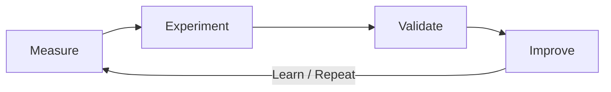

<p align="center">
  
</p>

<h1 align="center">
  Kraftverk
  
  🇸🇪
</h1>

<p align="center">
  <strong>Evidence-driven systems performance platform</strong><br />
  Measure real work → experiment with reversible settings → keep only what statistically improves.
</p>

<p align="center">
  <a href="https://github.com/theworker02/kraftverk/actions/workflows/ci.yml"></a>
  <a href="LICENSE"></a>
  <a href="https://github.com/theworker02/kraftverk/releases"></a>
  
  
</p>

<p align="center">
  <a href="https://theworker02.github.io/kraftverk/">Docs site</a> ·
  <a href="https://github.com/theworker02/kraftverk/releases">Releases</a> ·
  <a href="docs/hardware-support.md">Hardware support</a> ·
  <a href="CHANGELOG.md">Changelog</a>
</p>

---

**Kraftverk** (Swedish-inspired: *kraftverk* ≈ **power plant / powerhouse / power station**) is an independent performance engineering instrument for **AMD** systems. It is **not** affiliated with or endorsed by AMD, the Kingdom of Sweden, or any Swedish government entity.

Not a PC cleaner. Not a placebo FPS booster. Not a cloud service.

## Philosophy

Every optimization must improve measured performance, efficiency, stability, latency, thermal behavior, or instrumentation for better decisions. No fabricated telemetry. No magic buttons.



<p align="center">
  
</p>

Expanded loop: **Measure → Experiment → Benchmark → Validate → Compare → Keep or Revert → Learn → Repeat**

## Quick start

```bash
cargo build --release -p kraftverk-cli
cargo run -p kraftverk-cli -- compatibility
cargo run -p kraftverk-cli -- hardware
cargo run -p kraftverk-cli -- inspect
cargo run -p kraftverk-cli -- baseline
cargo run -p kraftverk-cli -- optimize --mode safe --goal balanced
cargo run -p kraftverk-cli -- status
cargo run -p kraftverk-cli -- report --format html
cargo run -p kraftverk-cli -- restore --baseline
```

Desktop (same local DB):

```bash
cargo run -p kraftverk-desktop
```

Binaries: see [GitHub Releases](https://github.com/theworker02/kraftverk/releases). Site: [theworker02.github.io/kraftverk](https://theworker02.github.io/kraftverk/).

## Hardware support (AMD-only)

Policy **`amd-only-v1`** is a hard gate:

| Requirement | Rule |
|-------------|------|
| Architecture | **x86 / x86_64** only |
| CPU | **AMD** (`AuthenticAMD`) |
| GPU | No GPU OK; if present, **AMD only** (PCI `0x1002`). NVIDIA/Intel GPU → fail |

Exit codes **20–25**. Inspect-only without gate: `kraftverk compatibility`, `kraftverk hardware`, `kraftverk amd cpu|gpu`.

Full policy: [docs/hardware-support.md](docs/hardware-support.md).

> AMD is a trademark of Advanced Micro Devices, Inc. Kraftverk does not use AMD logos and makes no “official AMD” claim.

## What works (0.2)

| Area | Status |
|------|--------|
| AMD eligibility gate (CLI/desktop/SDK/agent/optimizer) | Working |
| `compatibility` / `hardware` / `amd cpu|gpu` | Working (inspect-only) |
| `inspect` / `doctor` / `capabilities` | Working |
| KraftBench v2 (CPU scaling, compile proxy, responsiveness, sustained) | Working |
| `baseline` / `benchmark [--sustained 10m]` | Working |
| `optimize` with goals, constraints, sessions/resume + hot-plug recheck | Working |
| `history` / `explain` / `compare` / `lineage` / `insights` | Working |
| `profile` export/inspect/apply/validate/recommend | Working |
| `report` html/json | Working |
| `chase` / `analyze` | Working |
| Desktop instrument UI + hardware blocker | Working |
| Privileged agent / GPU benches | Scaffold / unsupported (honest) |

## Goals

`balanced` · `gaming` · `compile` · `workstation` · `throughput` · `latency` · `efficiency` · `sustained` · `quiet`

## Architecture (9 first-party crates)

```
crates/
├── kraftverk-core/
├── kraftverk-system/      # platform + hardware eligibility + telemetry
├── kraftverk-bench/
├── kraftverk-optimizer/   # search + profiles + objectives
├── kraftverk-data/        # SQLite + reports + sessions
├── kraftverk-agent/
├── kraftverk-sdk/
├── kraftverk-cli/
└── kraftverk-desktop/
```

More detail: [docs/architecture.md](docs/architecture.md) · diagram: [assets/architecture-flow.svg](assets/architecture-flow.svg)

## Branding

Geometric turbine / optimization-loop mark — engineering aesthetic, not gamer lightning.

| Asset | Path |
|-------|------|
| Mark / favicon | [assets/mark.svg](assets/mark.svg), [assets/favicon.svg](assets/favicon.svg) |
| Logo | [assets/logo.svg](assets/logo.svg) |
| Wordmark | [assets/wordmark.svg](assets/wordmark.svg) |

Guidelines: [docs/branding.md](docs/branding.md)

## Docs & community

- [DEVELOPMENT.md](DEVELOPMENT.md) · [docs/](docs/)
- [CONTRIBUTING.md](CONTRIBUTING.md) · [CODE_OF_CONDUCT.md](CODE_OF_CONDUCT.md) · [SECURITY.md](SECURITY.md)
- [docs/api-stability.md](docs/api-stability.md) · [docs/roadmap.md](docs/roadmap.md) · [CHANGELOG.md](CHANGELOG.md)
- Site: [https://theworker02.github.io/kraftverk/](https://theworker02.github.io/kraftverk/)

## License

**Proprietary — All Rights Reserved.** Copyright © 2026 [theworker02](https://github.com/theworker02).

You may view and run the Software as published. **Modification, redistribution of modified versions, and sublicensing are not permitted** without explicit written permission from the Copyright Holder. See [LICENSE](LICENSE).

This is **not** MIT/Apache (or any permissive open-source license). Source visibility does not grant a free-modification copyright umbrella under theworker02’s name.
