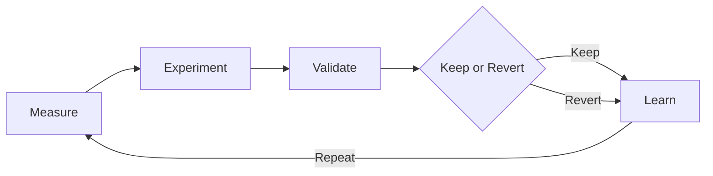

# Buyer evaluation — → http://127.0.0.1:47821/

## Goal

In 15–45 minutes, verify the Product builds or runs as documented and that proprietary notices are present.

## Steps

1. Confirm root `LICENSE` is proprietary and `ACQUISITION.md` exists.
2. Skim `README.md` install/run claims.
3. Execute:

```

```bash
kraftverk compatibility
kraftverk hardware
kraftverk amd cpu
kraftverk amd gpu
```
```bash
kraftverk optimize --mode safe --goal balanced
kraftverk optimize --mode balanced --goal compile
kraftverk optimize --mode aggressive --goal throughput
```
```bash
kraftverk optimize --strategy hill-climb
kraftverk optimize --strategy epsilon-greedy
kraftverk optimize --strategy bayesian
```
```bash
kraftverk report --format html
kraftverk report --format json -o report.json
kraftverk receipt <experiment-id>
kraftverk receipt --verify path/to.kraft-receipt.json
kraftverk explain <id>
kraftverk compare <a> <b>
kraftverk analyze recent
```
```
crates/
├── kraftverk-core/       # Domain models, stats, Kraft Index, goals/constraints
├── kraftverk-system/     # Platform + hardware eligibility + sensors/telemetry
├── kraftverk-bench/      # KraftBench workloads (CPU… + optional AMD Vulkan GPU)
├── kraftverk-optimizer/  # Search strategies, profiles, objectives
```

4. Run tests if present (`npm test`, `pytest`, `cargo test`, `go test ./...`, etc.).
5. Record README vs observed behavior gaps in workpapers.

## Pass criteria

- [ ] Clone succeeds
- [ ] Documented happy path works **or** failure is explained
- [ ] Minimal path needs no surprise secrets
- [ ] License notices intact

*Updated: 2026-09-22*
